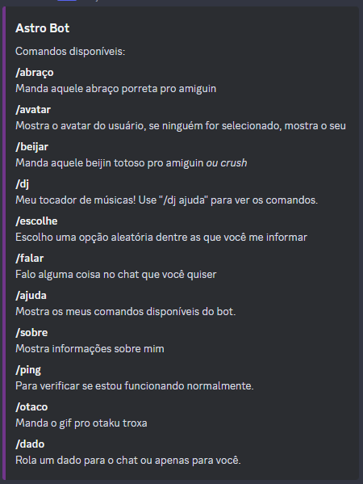
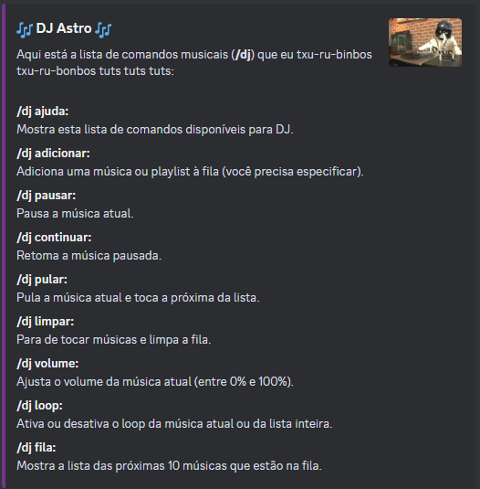

<div style="display: flex; flex-direction: column; justify-content: center; align-items: center;">

<h2>AstroBot</h2>
</div>


## Sobre o projeto

O Astro é um bot de discord, feito para entreter e fazer a moderação do [Survidor](https://discord.gg/jHhqrvPH).

Começou a ser desenvolvido com intuito de estudar e praticar Javascript em março de 2022, quando me preparava para fazer a transição de carreira para desenvolvimento de sistemas web.

Aos poucos e após diversos commits, fui me divertindo e adicionando novas funções ao bot, tendo os membros do canal do [Survidor](https://discord.gg/jHhqrvPH) como clientes e proprietários do produto, que me passavam pedidos e feedbacks.

Começou como uma brincadeira, mas com os conhecimentos acumulados o bot foi sendo aprimorado e atualizado, inclusive, trazendo refatorações para que o código fosse mais legível.

Se ficou curioso para conhecer esse simpático bot melhor, é só entrar no [Survidor](https://discord.gg/jHhqrvPH)!


### Tecnologias utilizadas

* [![Node][Node.js]](https://nodejs.org/en)
* [![Discord.js][Discord.js]](https://discord.js.org/)
* [![discord-player][discord-player]](https://discord-player.js.org/)


## Como rodar?
### Pré-requesitos:
Para rodar este bot, você precisa ter instalado as seguintes dependências na sua máquina:
1. [Node.js v18.16 (LTS) - hydrogen](https://nodejs.org/en/blog/release/v18.16.0)
2. [npm v9.5.1](https://www.npmjs.com/)
3. [ffmpeg v6](https://ffmpeg.org/download.html)

### Instalação
1. Clone o repositório
```sh
git clone git@github.com:guillepinho/AstroBot.git
```
2. Crie um arquivo .env na raiz do projeto, com a seguinte configuração (.env.example):
```env
DISCORD_TOKEN=<O TOKEN DO SEU BOT>
CLIENT_ID=<O ID DO SEU BOT>
GUILD_ID=<O ID DO SEU SERVIDOR DO DISCORD>
```
3. Instale os pacotes
```sh
npm install
```
4. Rode o comando para iniciar a execução do bot em modo de desenvolvimento
```sh
npm run dev
```
5. Se tudo der certo, abra outro terminal e rode o seguinte para carregar os comandos do bot no discord, se não, verifique seu arquivo .env
```sh
npm run load
```
6. Pronto! Tudo está configurado. Você pode a partir de então iniciar o bot pelo terminal com o seguinte comando:
```sh
npm start
```

## Comandos do Bot

<div style="display: flex; justify-content: center; align-items: flex-start;">


</div>

## Contribuições
Caso tenha interesse em contribuir com este projeto, sinta-se à vontade! Qualquer sugestão, inspiração, ideias ou até mesmo melhorias na legibilidade do código são muito bem-vindas! Você pode me ajudar assim:

1. Fork o repositório
2. Crie uma branch, nomeando a feature ou fix (```git checkout -b feature/Spyfall```)
3. Dê commit nas suas modificações (```git commit -m '(spyfall): configs iniciais'```)
4. Faça o push para a branch (```git push -u origin feature/Spyfall```)
5. Abra um Pull Request

## Licença
Este projeto é distribuído sob a licença MIT. Veja o arquivo ```LICENSE.txt``` para mais informações.


<!-- MARDOWN LINKS * IMAGENS -->
[Node.js]: https://img.shields.io/badge/node.js-000000?style=for-the-badge&logo=nodedotjs&logoColor=green
[Discord.js]: https://img.shields.io/badge/discord.js-35495E?style=for-the-badge&logo=discord&logoColor=white
[discord-player]: https://img.shields.io/badge/discord%20player-35495E?style=for-the-badge&logo=npm&logoColor=white